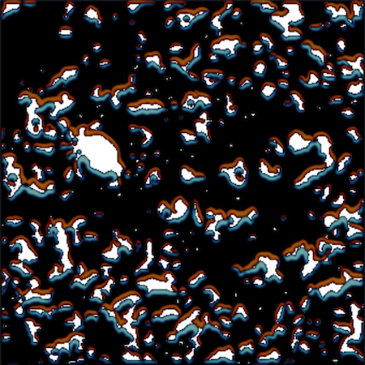

# Pika: Phase-field Snow Micro-structure Model

[gimmick:ForkMeOnGitHub (position: 'right', color: 'darkblue')
](http://www.github.com/idaholab/pika)

## Overview

Pika is a phase-field micro-structure model for dry snow that was
developed using the [MOOSE](https://www.mooseframework.org) framework
at the [Idaho National Laboratory](https://www.inl.gov) following the
work of [Kaempfer and Plapp(2009)](http://journals.aps.org/pre/abstract/10.1103/PhysRevE.79.031502). It
is a fully-coupled 3D finite element, phase field model capable of
tracking the phase transition and capturing the heat and mass transfer
at the micro-structure scale in the ice matrix and pore space.

The image shown are results generated with Pika, which depicts the difference between the phase-field variable between initial and final simulations steps demonstrating where mass was gained (blue) and lost (orange). The phase-chage in this example was driven by a strong temperature gradient over a 4 hours of simulated time. The colors are shown superimposed on the raw input, which is a 2D micro-CT scan of snow obtained at the [Subzero Science and Engineering Research Facilty](http://www.coe.montana.edu/ce/subzero) at [Montana State University](http://www.montana.edu).

## Contact
This projects is under the direction of Andrew E. Slaughter please contact him at andrew.slaughter@inl.gov for more information.
